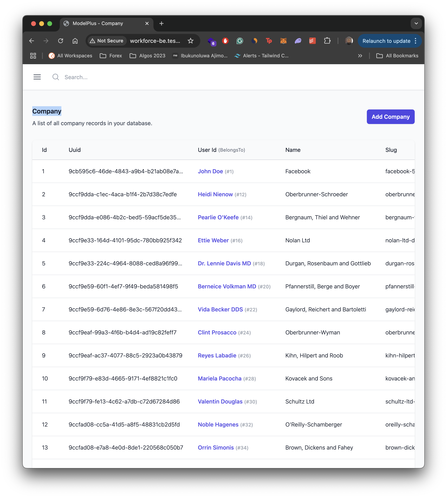

# ModelPlus

ModelPlus is an intuitive UI package for Laravel that provides a powerful and user-friendly interface for browsing your Eloquent models. It automatically discovers your models and creates a dynamic, interactive dashboard for viewing your application's data.

## Installation

You can install the package via composer:

## Available Features

- **Automatic Model Discovery**: Automatically scans and discovers all Eloquent models in your application
- **Interactive Dashboard**: Clean, modern UI built with Tailwind CSS and Alpine.js
- **Smart Relationship Handling**: 
  - Automatically detects and displays model relationships
  - Interactive hover cards for related models
  - Smart navigation between related models
- **Intelligent Display**: 
  - Automatically determines the best display column for each model
  - Smart formatting for different data types
  - Handles null values and boolean states elegantly
- **Advanced Table Features**:
  - Sortable columns
  - Real-time search
  - Pagination
  - Sticky first column
  - Responsive design
- **Security**:
  - Configurable authentication requirements
  - Debug mode protection
  - Middleware-based access control

## Screenshots

## Coming Soon

- Record management (Create, Edit, Delete operations)
- Detailed record view
- Advanced filtering
- Bulk actions
- Custom display rules
- Export functionality
- And more!

## Configuration

The package can be configured via the `config/modelplus.php` file:

- Define custom model paths
- Configure route prefix and middleware
- Set pagination preferences
- Specify hidden fields
- Control authentication requirements

## Security

By default, ModelPlus is only accessible in debug mode or to users with the `access-modelplus` permission. This behavior can be customized in the configuration file.

## Usage

Once installed, navigate to `/modelplus` in your browser to access the dashboard. The interface will automatically display all discovered models in a sidebar, allowing you to:

- Browse records for each model
- View relationships between models
- Sort and search records
- Navigate through related data
- View detailed information via hover cards

<!-- ## Local Development

For local development:

1. Add this to your `composer.json`:

## For local development:
1. Add this to your ` -->